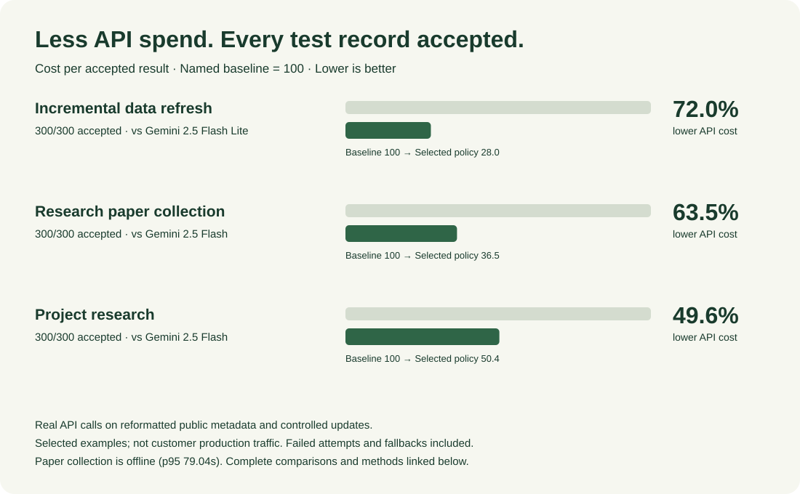

# Reins

<p></p>

**New local workflow:** [Public project update Agent](docs/PROJECT_AGENT.md) combines
commit-pinned sources, incremental extraction, durable request recovery, and a
read-only status page. Run the finite Gemini comparison locally; inspect quality
and cost together before making a savings claim. No server deployment is required.

**Meet the quality bar. Lower the cost of every accepted task.**

Reins is a Python SDK for outcome-based Agent optimization, starting with data
collection and structured extraction. Evaluate execution policies on the same
tasks, exclude those that miss quality or latency constraints, and select the
lowest recorded cost per accepted result. Trace execution and enforce budgets
through the same runtime.

**v0.2 is a local pilot.** Observation is the default. Worker traces remain single-writer.
The optional shared control service coordinates multiple processes on one host.
No savings or quality improvement is claimed until measured on your tasks.

## Shared runtime economic control

Reserve before spending. Attribute every paid operation to a customer, workflow
and parent task. Keep uncertain charges held, constrain runaway branches, and
reconcile confirmed invoice lines without erasing history.

```sh
reins control serve
# Local read-only dashboard: http://127.0.0.1:8795
```

[Integration guide and failure semantics](docs/RUNTIME_CONTROL.md) ·
[Local simulated example](examples/runtime_control.py)

Explicit enforcement can pause work or fall back only to task-approved models.
Remaining-cost forecasts become available after 30 matching measured histories;
they advise operators and do not automatically terminate tasks.

## Measured Gemini cases

Selected completed benchmarks, synchronized with the public case page on September 30, 2026.

<p></p>

| Workload | Accepted test records | Lower API cost per accepted result | Comparison baseline |
|---|---:|---:|---|
| Incremental data refresh | 300/300 | 72.0% | One-item Gemini 2.5 Flash Lite |
| Research paper collection | 300/300 | 63.5% | One-item Gemini 2.5 Flash |
| Project research | 300/300 | 49.6% | One-item Gemini 2.5 Flash |

[Interactive cases](https://47.245.114.167:8443/cases.html) ·
[Readable benchmark report](docs/assets/reins-savings-report.pdf) ·
[Recorded comparison data](docs/assets/featured-cases.json)

Real API calls on reformatted public metadata and controlled updates, selected
retrospectively from completed experiments. Acceptance checks required reference
fields; these are not customer production results. Savings include failed attempts
and fallback calls and are relative to the named baseline. Deterministic parsing
is also a baseline for these structured inputs. Paper collection is an offline
workload (p95 79.04 seconds); the other two examples have p95 below 60 seconds.
These results do not imply that every workflow benefits or that savings are exclusive
to Reins. The report includes the full four-workload presentation, including invoices.

The latest local raw-document project-update experiment is separate from these
benchmarks and has not established production-quality savings. The runtime-control integration study is also separate from these public cases.

---

## Optimize a real task, not just a token bill

- **Evaluate:** identical cases, versioned policies, explicit business acceptance.
- **Select:** quality and latency gates before cost ranking; incomplete charges
  and unmatched cases cannot produce a recommendation.
- **Execute:** an explicit small-first / validate / fallback policy with budget
  control and step-level visibility.
- **Check:** separate validation and test experiments; test results never retune
  the winner. Export a report before manually adopting a policy.

The optimizer compares functions you supply. A validation-trained segment router
can freeze a choice per input segment, with baseline fallback for sparse segments.
It does not compress models or automatically deploy changes.

```bash
PYTHONPATH=src python examples/outcome_optimizer.py \
  --database /tmp/reins-optimizer.duckdb --dashboard --port 8766
```

Open **http://127.0.0.1:8766 → 策略优化**. No API keys required; all responses
and prices are synthetic. The example includes validator and fallback fees,
rejects a cheap low-quality candidate, and separately tests the selected policy.
See [Optimization guide](docs/OPTIMIZATION.md) to connect real candidates,
quality criteria and deployment configurations.

For the product website preview, see [website/README.md](website/README.md).

## Data-agent execution and real Gemini experiments

- **Deadline batching:** isolate tenants, task types, schemas and policies; include
  queueing in latency and bound concurrent provider calls.
- **Incremental checkpoints:** persist successful steps in SQLite, reuse unchanged
  inputs, invalidate downstream steps by dependency revision, and require explicit
  reconciliation before retrying interrupted paid work.
- **Frozen policies:** learn only from validation inputs and outcomes. Holdout checks
  block adoption when observed quality, latency or cost fails the configured gate.
- **Recorded cases:** four English, read-only case studies show real Gemini calls,
  reference-field acceptance, queue time, cost estimates and strong parser baselines.

See [Data Agent guide](docs/DATA_AGENTS.md),
[measured results](output/benchmarks/data-agents-v1/RESULTS.md), and
[the case replay](https://47.245.114.167:8443/cases.html).
These are experiments on reformatted public metadata and constructed invoices,
not production customer traffic or proof of superiority to managed AgentCore.
Simple parsing is included deliberately: avoiding an unnecessary model call is
useful, but is not an exclusive technology advantage.

```bash
PYTHONPATH=src python examples/incremental_data_agent.py
python -m http.server 8793 --directory website
# http://127.0.0.1:8793/cases.html — no API calls from the browser
```

## Install

```bash
pip install .                 # from this checkout
pip install -e '.[dev,proxy]' # contributors
```

Python 3.10+. Model-provider SDKs are optional and installed separately. The public
package registry may still contain an earlier release; this checkout is v0.2.

## Observe a task

```python
from reins import configure, trace, record_outcome

configure(storage_path="pilot.duckdb", mode="observe")

@trace(agent_name="supplier_research", task_type="field_extraction",
       policy_version="baseline", budget="$0.50")
async def research_supplier(source):
    result = await your_agent(source)  # instrumented SDK calls
    record_outcome(success=validate_fields(result), score=field_score(result))
    return result
```

The application defines quality. Completing a function or receiving HTTP 200 is
not automatically a successful business outcome. Call `record_retry()` for actual
application retries and `record_external_cost(amount, label="...")` for incurred
tool/evaluation fees. External cost reporting is not a spending authorization.

```bash
reins compare --database pilot.duckdb --task-type field_extraction
```

Reports group tasks by dataset, task type, policy version, and operating mode.
They include sample sizes, success rate, an approximate Wilson interval,
known total cost, pending charges, cost per successful task, p95 duration, model
switches, and caller-reported retries. Failed attempts are included in the cost
numerator. Missing outcomes or pending charges suppress cost-per-success claims.

## Try it without API keys

```bash
python examples/extraction_pilot.py --database /tmp/reins-demo.duckdb
reins compare --database /tmp/reins-demo.duckdb
```

The demo uses **synthetic responses and prices**, runs the actual budget and
recording paths, and compares a fixed strong model, a fixed small model, and a
budget-triggered policy on identical extraction cases. It deliberately shows
quality loss from naive switching. These are not real-model performance results.
Use a fresh database for each independent demo.

For your own agent, `reins.evaluation.evaluate_dataset(cases, agent, ...)` accepts
an input/expected-fields fixture set and a sync or async function. It hashes the
dataset, repeats cases, and records exact-field quality checks. See [Pilot guide](docs/PILOT.md).

## Watch an agent run locally

```python
from reins import configure, trace, step, record_outcome

configure(storage_path="pilot.duckdb", dashboard=True, dashboard_port=8765,
          inactivity_seconds=60)

@trace(agent_name="supplier_research", task_type="field_extraction")
async def research(source):
    async with step("获取网页", kind="retrieval"):
        page = await fetch_page(source)  # your existing application function
    async with step("提取字段"):
        result = await your_agent(page)  # supported SDK calls are recorded automatically
    record_outcome(success=validate_fields(result))
    return result
```

Open **http://127.0.0.1:8765** while the Agent process is running. The read-only
panel refreshes every two seconds and shows tasks, active business steps, parallel
children, retries, errors, budget decisions and confirmed/pending costs. Click a
run for its event timeline. The second page compares cost and quality by dataset.
`step()` supports both `with` and `async with`; use a new context for each step.
Without explicit steps, Reins shows captured model calls, not inferred business stages.

A five-second runtime heartbeat indicates process liveness. After 15 seconds without
a fresh heartbeat, unfinished tasks are shown as **unknown**, not failed. No activity
for `inactivity_seconds` shows a separate warning; a slow model is not declared stuck.
Heartbeats cannot prove that application code is making progress. Interrupted tasks
retain reservations for billing reconciliation.

The server shares the running SDK's database connection, binds only to loopback,
and has no task-control endpoints. Configure before starting tasks. Keep the process
alive to inspect the panel; shut down using `reins.core.decorators.shutdown()`.
Port conflicts raise a clear startup error. Schema v3 adds event/instance tables
transactionally; old traces remain available but have no historical step events.
Do not add a second database writer or expose this local pilot UI to the network.

Try the full UI without credentials:

```bash
python examples/dashboard_demo.py --database /tmp/reins-dashboard-demo.duckdb
```

This demo seeds three synthetic strategies, runs three parallel collection batches
with an intentional source error/retry, then keeps the panel open. Stop with Ctrl+C.
All demo tasks are labelled simulated; neither the prices nor quality are live-model
measurements. Use a fresh database when you want an independent demonstration.

## Enforce a budget deliberately

`configure(mode="enforce", token_counter=..., prices=..., task_models=...)` enables
strict admission on the supported SDK path. Requirements:

- Pin exact model prices in USD per million input/output tokens. Built-in rates
  are illustrative observation defaults, not a current billing guarantee.
- Supply a trusted `token_counter(provider, model, request) -> int` that covers
  the complete input, including system messages and tools. It is called again
  for any proposed replacement model. A rough character estimate is insufficient.
- Supply `max_tokens` or `max_completion_tokens`. Set provider SDK retries to zero
  and trace application retries explicitly.
- Explicitly approve an ordered `provider/model` list per task type. Replacement
  is same-provider only and must fit **all** applicable budgets. Validate tool,
  structured-output, and other model capabilities before approving that pair.
- Only text, one completion per call, and ordinary input/output billing are
  supported for strict admission. Explicit cache writes, hosted search tools,
  and image/audio input are rejected. Cache-specific usage remains pending for
  explicit billing reconciliation; it is not reported as free.

Observation records the original call and what the policy would recommend. It
never changes the model or rejects a call for budget pressure. Enforce checks
per-run, ancestor-run, global daily/monthly and agent daily/monthly caps together.
Periods are UTC admission periods. A zero budget is a real zero limit.
`alert` does not authorize overspending in enforce mode. `pause` raises a typed
exception; the application owns recovery/resume.

Reservations are committed before dispatch and survive restart. Missing usage,
timeouts, and incomplete streams retain reservations. After checking provider
billing, use `reconcile_cost(span_id, actual_cost)` (including zero only when
confirmed unbilled). A violated input bound raises an accounting alert and blocks
further enforcement until acknowledged through reconciliation. Reins cannot undo
charges already billed by a provider or govern calls that bypass the SDK.

## Supported paths and limitations

| Path | v0.2 behavior |
|---|---|
| Anthropic Messages `.create`, sync/async, `stream=True` | Trace, usage, observation and opt-in admission |
| OpenAI Chat Completions `.create`, sync/async, `stream=True` | Same; streaming usage is requested explicitly |
| Framework callbacks / OTel | Trace observation only; callbacks do not guarantee request mutation |
| HTTP proxy | Experimental observation-only; not the first paid integration path |
| `reins replay` | Inspect recorded steps; does not re-execute or repair tasks |
| Lens context health | Token-based heuristic signals, not verified semantic root causes |
| Pulse | Placeholder; not a production guardrail or regression-test service |

The SDK uses process-wide instrumentation. Configure once before concurrent work;
await task children before their parent finishes. Use one runtime/storage writer
per database. Distributed shared budgets, OpenAI Responses, SDK `.stream()` helper
APIs, background orphan tasks, and arbitrary model migration are not guaranteed.
The ledger stores metadata and usage; this version does not persist full prompts.

## Migration from v0.1

- Default operation is observe; opt into enforce explicitly after a baseline.
- New durable request/account tables preserve historical runs and traces.
  Old `budget_balances` are retained but are **not imported**: old agent balances
  cannot safely be assigned to tasks. Initialize pilot limits deliberately.
- Unknown prices and invalid configuration no longer silently become zero/unlimited.
- `wrap(..., budget=...)` and unsupported `configure(budget=...)` now fail clearly;
  put task budgets on `@trace` and period budgets in YAML.
- No automatic static downgrade chain is used. Approved task models are required.
- Python 3.10 is now the minimum, matching the CI matrix.

## Position relative to other tools

LiteLLM has routing and budget controls; Portkey has conditional routing and budget
limits; LangSmith has tracing and evaluation. Reins' pilot focuses on a small,
local task-cost feedback loop and application-owned quality labels. That focus
is a hypothesis to test with customers, not a claim of unique features.

[LiteLLM budgets](https://docs.litellm.ai/docs/proxy/provider_budget_routing) ·
[Portkey routing](https://portkey.ai/docs/product/ai-gateway/conditional-routing) ·
[LangSmith evaluation](https://www.langchain.com/langsmith/evaluation)

## Development and pilot material

```bash
pytest -q
ruff check src tests
ruff format --check src tests examples
```

[Integration guide](docs/GUIDE.md) · [Pilot and evaluation protocol](docs/PILOT.md) ·
[Six-week customer development plan](docs/CUSTOMER_DISCOVERY.md)

## License

Source available under [Business Source License 1.1](LICENSE) (SPDX `BUSL-1.1`).
See the license for the noncompetitive-use grant and scheduled Apache conversion.
This release does not change those license terms.

## Reduce repeated model work

For independent offline extraction jobs, evaluate microbatch sizes and compact
output formats alongside model choice. `reins.batching.MicroBatchPolicy` preserves
input/output correspondence, validates each result, and retries only invalid items.
An optional source-driven transform can perform deterministic calculations before
validation. The same tools must be applied to all comparison baselines.

`select_configuration` applies quality, sample-size, settled-cost and optional
batch-service latency gates. It selects on paired validation records; a separate
audit checks the frozen configuration. See [Batching guide](docs/BATCHING.md).

Real-call benchmark protocols and complete retained rounds live in
[benchmarks/README.md](benchmarks/README.md). Results on constructed documents are
engineering evidence, not customer savings or proof of a proprietary model moat.

Measured example (real Gemini API, constructed invoices): the frozen compact-16 policy accepted 100/100 audit cases, with 50% lower list-price token cost and 7.53× sequential-job throughput than single-item Lite. Against compact-four batching, the gains were 11% and 2.03×, with higher p95 batch service time (5.79s vs 2.36s). [Experiment and limitations](website/benchmark-report.md).
