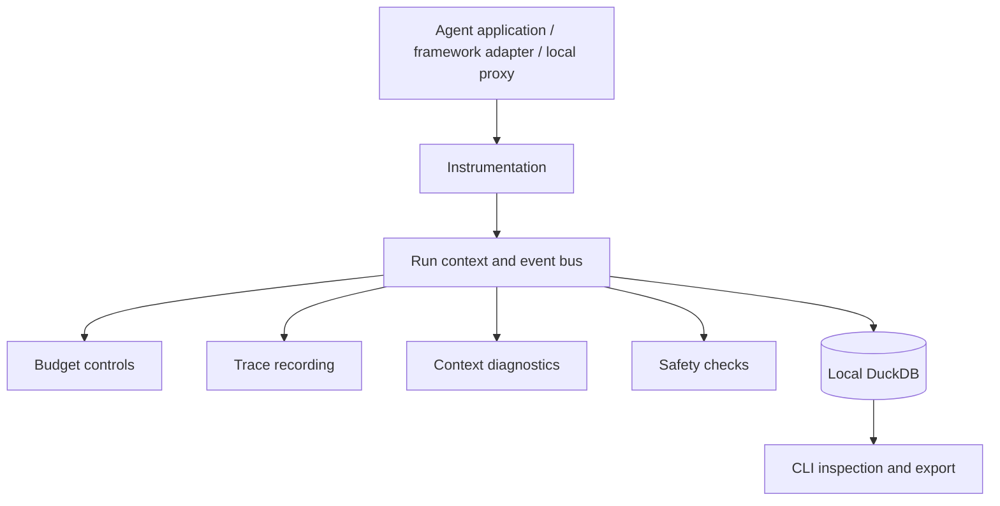

<p align="center">
  <h1 align="center">Reins</h1>
  <p align="center"></p>
  <p align="center"><strong>Take Control of Your AI Agents</strong></p>
  <p align="center">
    Trace agent execution, control budgets, and compare measured data workflows.<br/>
    <strong>Meet the quality bar. Reduce the cost of accepted results.</strong>
  </p>
  <p align="center">
    <a href="#quick-start">Quick Start</a> &bull;
    <a href="#features">Features</a> &bull;
    <a href="#framework-support">Frameworks</a> &bull;
    <a href="#documentation">Docs</a> &bull;
    <a href="#why-reins">Why Reins</a>
  </p>
</p>

---

```python
pip install reins

from reins import trace

@trace(budget="$0.50", on_exceed="degrade")
async def my_agent(task: str):
    response = await client.messages.create(model="claude-sonnet-4-20250514", ...)
    return response
    # When budget runs low → auto-switches to claude-haiku (not crash)
```

**One decorator. Budget control + cost tracking + auto-degradation + trace recording.**

---

## Measured Gemini cases

Selected completed benchmarks, synchronized with the public case page on September 30, 2026.

<p align="center"></p>

| Workload | Accepted test records | Lower API cost per accepted result | Comparison baseline |
|---|---:|---:|---|
| Incremental data refresh | 300/300 | 72.0% | One-item Gemini 2.5 Flash Lite |
| Research paper collection | 300/300 | 63.5% | One-item Gemini 2.5 Flash |
| Project research | 300/300 | 49.6% | One-item Gemini 2.5 Flash |

[Interactive cases](https://47.245.114.167:8443/cases.html) ·
[Readable benchmark report](docs/assets/reins-savings-report.pdf) ·
[Recorded comparison data](docs/assets/featured-cases.json)

Real API calls on reformatted public metadata and controlled updates, selected
retrospectively from completed experiments. Acceptance checks required reference
fields; these are not customer production results. Savings include failed attempts
and fallback calls and are relative to the named baseline. Deterministic parsing
is also a baseline for these structured inputs. Paper collection is an offline
workload (p95 79.04 seconds); the other two examples have p95 below 60 seconds.
These results do not imply that every workflow benefits or that savings are exclusive
to Reins. The report includes the full four-workload presentation, including invoices.

The latest local raw-document project-update experiment is separate from these
benchmarks and has not established production-quality savings. Local experimental
SDK features are not part of this documentation-only update.

---

## Why Reins?

Agent teams need to understand what each task costs, where it fails, and which
execution policy still delivers the required result with less model work.

The published SDK provides tracing, budget controls and execution diagnostics.
The measured data workflows above explore three practical optimizations: reuse
unchanged fields, batch compatible records, and choose a model for the task.
Their benchmark results are separate from the published SDK's feature coverage.

Use the named baseline and acceptance check to interpret every comparison.
A lower token bill alone is not proof of a better outcome, and ordinary caching
or deterministic parsing can be the right baseline.

---

## Quick Start

### For Your Own Agents

```bash
pip install reins
```

```python
from reins import trace

@trace(budget="$0.50", on_exceed="degrade")
async def my_agent(task: str):
    client = anthropic.AsyncAnthropic()
    response = await client.messages.create(
        model="claude-sonnet-4-20250514",
        max_tokens=1024,
        messages=[{"role": "user", "content": task}],
    )
    return response.content[0].text
```

When the budget runs low, Reins automatically switches `claude-sonnet` to `claude-haiku` — your agent keeps running, just cheaper.

### For Claude Code

```bash
pip install reins[proxy]

# Start local proxy with $5/day budget
reins proxy --port 8082 --budget '$5/day' --on-exceed degrade

# Point Claude Code at it
export ANTHROPIC_BASE_URL=http://localhost:8082

# Use Claude Code normally — Reins controls costs transparently
claude "refactor this module"
```

### Check Your Costs

```bash
# Cost report
reins report

# Trace visualization
reins trace list
reins trace show <run_id>

# Context health analysis
reins health <run_id>

# Step-by-step replay
reins replay <run_id>
```

---

## Features

### Modular Architecture — Use What You Need

```bash
pip install reins              # Core: auto-tracing + DuckDB storage
pip install reins[budget]      # + Cost governance
pip install reins[lens]        # + Debugging (replay, context health)
pip install reins[pulse]       # + Reliability (guardrails, evaluation)
pip install reins[all]         # Everything
```

### Core (Always Installed)

- **Auto-instrumentation**: Monkey-patches Anthropic & OpenAI SDKs — zero code changes to capture all LLM calls
- **DuckDB storage**: Embedded, zero-config. No Redis, no Postgres, no Docker
- **SQL queries**: `reins query "SELECT * FROM spans WHERE cost > 0.1"`
- **Streaming support**: Transparent interception of streaming responses

### Budget Module

- **Per-run budgets**: `@trace(budget="$0.50")` — hard cap per agent execution
- **4 exceed strategies**: `degrade` (auto-switch model) / `pause` / `alert` / `reject`
- **Model degradation chains**: `opus → sonnet → haiku`, `o3 → gpt-4o → gpt-4o-mini`
- **Circuit breaker**: Auto-halts runaway agent loops (>30 calls/minute)
- **Budget persistence**: Survives process restarts, daily/monthly auto-reset
- **Cost anomaly detection**: Alerts when a run costs 3x the historical average
- **YAML team budgets**: Organization → team → agent hierarchy

```yaml
# reins.yaml
budgets:
  daily: $10.00
  agents:
    research_agent: { per_run: $2.00, on_exceed: degrade }
    code_agent: { per_run: $0.50, on_exceed: reject }
```

### Trace Module

- **`reins trace list`**: Recent runs table with cost, status, degradation count
- **`reins trace show`**: Colored terminal call tree (LLM + tool calls)
- **`reins trace export --format otel`**: OTLP JSON export for Grafana/Datadog
- **Cross-agent correlation**: Automatic trace_id propagation

### Lens Module

- **`reins replay`**: Interactive step-by-step agent replay (Enter/auto-play/quit)
- **`reins health`**: Context health curve with ASCII chart + per-span breakdown
- **Context Rot detection**: 3-metric composite score (utilization, efficiency, duplication)
- **Root cause analysis**: Automatic causal chain for failures

### Pulse Module (Phase 3)

- Runtime evaluators (coherence, instruction following)
- Guardrail engine (PII detection, SQL injection prevention)
- Automatic regression test generation from failed runs

### Proxy Mode

- **Transparent reverse proxy** for Claude Code, aider, Cursor, or any tool that respects `ANTHROPIC_BASE_URL`
- Full budget enforcement at the HTTP layer
- Zero changes to the upstream tool

---

## Framework Support

Reins integrates with **10+ agent frameworks** through 4 adapters:

| Adapter | Frameworks | Integration |
|---------|-----------|-------------|
| **`ReinsCallbackHandler`** | LangChain, LangGraph, LangFlow | `ChatAnthropic(callbacks=[handler])` |
| **`ReinsTracingProcessor`** | OpenAI Agents SDK | `add_trace_processor(processor)` |
| **`instrument_crew()`** | CrewAI | `instrument_crew(crew)` |
| **`ReinsSpanExporter`** | Semantic Kernel, Pydantic AI, Haystack, Mastra | OTel SpanProcessor |

### LangChain / LangGraph

```python
from reins.adapters.langchain import ReinsCallbackHandler

handler = ReinsCallbackHandler(agent_name="my_langchain_agent")
llm = ChatAnthropic(model="claude-sonnet-4-20250514", callbacks=[handler])
chain = prompt | llm | parser
result = chain.invoke({"input": "..."})
```

### OpenAI Agents SDK

```python
from reins.adapters.openai_agents import ReinsTracingProcessor
from agents import Agent, Runner, add_trace_processor

add_trace_processor(ReinsTracingProcessor())

agent = Agent(name="assistant", model="gpt-4o")
result = Runner.run_sync(agent, "Hello!")
```

### CrewAI

```python
from reins.adapters.crewai import instrument_crew
from crewai import Crew, Agent, Task

crew = Crew(agents=[...], tasks=[...])
instrument_crew(crew)  # One line — instruments all agents and tasks
result = crew.kickoff()
```

### Any OTel-Native Framework (Semantic Kernel, Pydantic AI, Haystack, Mastra)

```python
from reins.adapters.otel import ReinsSpanProcessor
from opentelemetry.sdk.trace import TracerProvider

provider = TracerProvider()
provider.add_span_processor(ReinsSpanProcessor())
# Now any OTel-instrumented framework is automatically traced by Reins
```

---

## Runtime architecture



This diagram describes the published SDK. Benchmark policy evaluation and the
public website are separate artifacts; this release does not automatically deploy
an optimized production policy. See the source and technical design for the
behavior of each optional module.

---

## Documentation

- [Product Requirements (PRD)](docs/PRD.md) — What we build and why
- [Technical Design](docs/DESIGN.md) — Architecture, data models, API design

---

## Development

```bash
# Clone
git clone https://github.com/catyans/reins.git
cd reins

# Install with dev deps
pip install -e ".[dev,all]"

# Run tests
pytest tests/ -v

# Generate charts
python scripts/generate_charts.py
```

**99 tests** across unit and integration suites.

---

## License

[Business Source License 1.1](LICENSE) (BSL 1.1)

- **Free for**: personal use, internal enterprise use, academic research, contributing back
- **Not allowed**: building a competing commercial AI agent cost governance product/service
- **Auto-converts to Apache 2.0** on April 4, 2030

For commercial licensing inquiries: 237344440@qq.com

---

## Author

**Yanshu Wang** ([@catyans](https://github.com/catyans)) — [https://catyans.github.io](https://catyans.github.io)

---

<p align="center">
  <strong>Reins: Take control of your AI agents.</strong><br/>
  <code>pip install reins</code>
</p>
